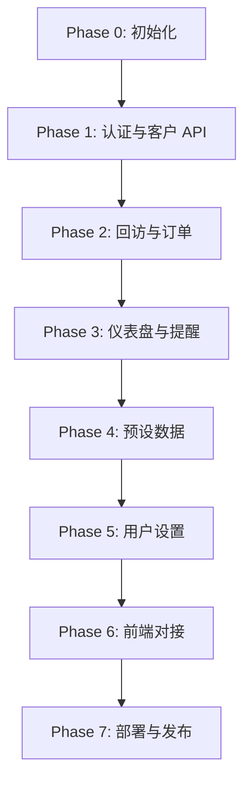

# 05｜重新开发任务规划

本任务规划提供 AI-CRM Serverless 重构的阶段化实施路径，支持自动化 CI/CD 流水线与 AI 智能体协作。

---

## 1. 总体里程碑

| 阶段 | 目标 | 交付物 | 验收标准 |
| --- | --- | --- | --- |
| **Phase 0** | 项目初始化 | 脚手架、环境配置、数据库建表 | 本地 `vercel dev` 能正常启动，healthcheck 接口返回 200 |
| **Phase 1** | 认证与基础 API | 登录、刷新 Token、客户 CRUD | 单元测试通过，Postman 测试套件全绿 |
| **Phase 2** | 回访与订单 | 回访 CRUD、产品 CRUD、自动计算跟进日期 | 集成测试通过，仪表盘可拉取部分数据 |
| **Phase 3** | 仪表盘与提醒 | 统计算法实现、提醒聚合、Cron 任务 | 数据准确性验证，定时任务日志正常 |
| **Phase 4** | 预设数据管理 | 所有预设表 CRUD + 排序 | 前端可正常配置并生效 |
| **Phase 5** | 用户设置与维护 | 深色模式、通知、备份、恢复 | 备份文件成功上传到云存储，恢复能还原数据 |
| **Phase 6** | 前端对接与优化 | 静态页面接入 API、响应式、测试 | E2E 测试覆盖核心路径，Lighthouse ≥ 90 分 |
| **Phase 7** | 部署与发布 | 生产部署、性能优化、文档发布 | 线上稳定运行 7 天，无关键 Bug |

---

## 2. 任务拆解（Phase 0 - 项目初始化）

### 2.1 创建目录结构

```bash
mkdir -p {api,app,prisma,tests,scripts,doc_move}
```

### 2.2 安装依赖

- 核心：`express`, `@prisma/client`, `jsonwebtoken`, `bcryptjs`, `zod`
- 工具：`typescript`, `tsx`, `vercel` (CLI), `nodemon`
- 测试：`vitest`, `supertest`, `@testing-library/*`

### 2.3 配置 Prisma

1. 在 `prisma/schema.prisma` 中定义所有数据模型（参照 `01_项目需求规格说明.md` 第 4 节）。
2. 运行 `npx prisma generate` 生成客户端。
3. 运行 `npx prisma migrate dev --name init` 创建初始迁移。

### 2.4 创建种子脚本 `prisma/seed.ts`

```typescript
import { PrismaClient } from '@prisma/client';
import bcrypt from 'bcryptjs';

const prisma = new PrismaClient();

async function main() {
  // 创建管理员
  await prisma.manager.create({
    data: {
      name: 'admin',
      password: await bcrypt.hash('admin123', 10),
    },
  });

  // 创建预设数据（客户分类、意向等级等）
  // ...
}

main()
  .catch(console.error)
  .finally(() => prisma.$disconnect());
```

运行 `npx prisma db seed`。

### 2.5 创建 `vercel.json`

```json
{
  "version": 2,
  "functions": {
    "api/**/*.ts": { "runtime": "nodejs18.x" }
  }
}
```

### 2.6 配置环境变量

创建 `.env.local` 并填入：
```env
DATABASE_URL="postgres://..."
JWT_SECRET="..."
JWT_REFRESH_SECRET="..."
```

### 2.7 验收标准（DoD）

- [ ] `vercel dev` 启动成功。
- [ ] `GET /api/health` 返回 `{ "status": "ok" }`。
- [ ] Prisma Studio (`npx prisma studio`) 能查看数据库。

---

## 3. 任务拆解（Phase 1 - 认证与基础 API）

### 3.1 创建 JWT 工具 `api/utils/jwt.ts`

```typescript
export function createAccessToken(user: { id: number; name: string }): string;
export function createRefreshToken(user: { id: number; name: string }): string;
export function verifyAccessToken(token: string): { id: number; name: string } | null;
export function verifyRefreshToken(token: string): { id: number; name: string } | null;
```

### 3.2 创建认证中间件 `api/utils/middleware.ts`

```typescript
export function withAuth(handler: Handler): Handler;
export function withRateLimit(config: { requests: number; window: number }): Middleware;
export function withValidation(schema: ZodSchema): Middleware;
```

### 3.3 实现登录 `api/auth/login.ts`

- 验证用户名与密码。
- 使用 bcrypt 比较密码。
- 签发 Access Token 与 Refresh Token。
- 返回 `{ success, user, token, refreshToken }`。

### 3.4 实现刷新 `api/auth/refresh.ts`

- 验证 Refresh Token。
- 颁发新的 Access Token 与 Refresh Token。
- 记录日志。

### 3.5 实现客户 CRUD `api/customers/index.ts`, `api/customers/[id].ts`

| 接口 | 文件 | 方法 |
| --- | --- | --- |
| 获取列表 | `index.ts` | GET |
| 创建客户 | `index.ts` | POST |
| 获取详情 | `[id].ts` | GET |
| 更新客户 | `[id].ts` | PUT |
| 删除客户 | `[id].ts` | DELETE |

- 使用 `withAuth`, `withValidation`。
- 实现分页、搜索、过滤。

### 3.6 编写单元测试 `tests/api/auth.test.ts`, `tests/api/customers.test.ts`

使用 `vitest` 与 `supertest`：
```typescript
describe('POST /api/auth/login', () => {
  it('should return token on valid credentials', async () => {
    const res = await request(app)
      .post('/api/auth/login')
      .send({ username: 'admin', password: 'admin123' });
    expect(res.status).toBe(200);
    expect(res.body.token).toBeDefined();
  });
});
```

### 3.7 验收标准（DoD）

- [ ] 登录接口通过测试。
- [ ] 客户 CRUD 所有接口通过测试。
- [ ] Postman / REST Client 测试套件全部通过。

---

## 4. 任务拆解（Phase 2 - 回访与订单）

### 4.1 实现回访 CRUD `api/visits/*.ts`

- 支持按客户过滤。
- 创建时自动更新客户意向（如填写）。

### 4.2 实现产品 CRUD `api/products/*.ts`

- 创建时自动计算 `followUpDate`（`purchaseDate + 90天`）。
- 提供统计接口 `api/products/statistics.ts`（销售额、订单数、Top 产品）。

### 4.3 编写集成测试

- 创建客户 → 创建回访 → 查询回访列表。
- 创建产品订单 → 验证 `followUpDate` 自动生成。

### 4.4 验收标准（DoD）

- [ ] 回访与订单接口通过测试。
- [ ] 统计接口返回正确数据。

---

## 5. 任务拆解（Phase 3 - 仪表盘与提醒）

### 5.1 实现仪表盘统计 `api/dashboard/statistics.ts`

参照 `03_项目规则与AI算法.md` 第 3 节实现：
- 月度销售额、订单数、新增客户、回访次数。
- 意向分布。
- 重要提醒（计划回访、产品回访、生日）。

### 5.2 创建定时任务 `api/cron/daily-backup.ts`

- Vercel Cron 配置：
  ```json
  {
    "crons": [
      {
        "path": "/api/cron/daily-backup",
        "schedule": "0 2 * * *"
      }
    ]
  }
  ```
- 备份数据库到 Vercel Blob 或 R2。

### 5.3 编写提醒算法测试

- 插入测试数据（带有 `planned_visit_date`、`followUpDate`、`birthday`）。
- 查询提醒列表，验证逻辑正确。

### 5.4 验收标准（DoD）

- [ ] 仪表盘接口返回完整统计数据。
- [ ] 提醒列表按日期升序排序。
- [ ] 定时任务日志正常记录。

---

## 6. 任务拆解（Phase 4 - 预设数据管理）

### 6.1 为每个预设表创建 CRUD 接口

- `api/presets/customer-categories.ts`
- `api/presets/customer-intentions.ts`
- `api/presets/regions.ts`
- `api/presets/budget-ranges.ts`
- `api/presets/visit-methods.ts`
- `api/presets/visit-types.ts`
- `api/presets/navigation-modes.ts`
- `api/presets/reminder-cycles.ts`
- `api/presets/preset-products.ts`
- `api/presets/superior-contacts.ts`
- `api/presets/subordinate-contacts.ts`

### 6.2 实现排序接口 `api/presets/reorder.ts`

接收 `{ type: 'customer-categories', ids: [3, 1, 2] }`，批量更新 `displayOrder`。

### 6.3 验收标准（DoD）

- [ ] 所有预设表接口通过测试。
- [ ] 排序功能正确更新数据库。

---

## 7. 任务拆解（Phase 5 - 用户设置与维护）

### 7.1 实现用户设置 CRUD `api/settings/*.ts`

- 获取、更新设置（深色模式、提醒开关、语言）。

### 7.2 实现备份 `api/maintenance/backup.ts`

- 使用 `pg_dump` 或 Prisma 导出。
- 上传至 Vercel Blob / R2。
- 返回备份文件名与时间戳。

### 7.3 实现恢复 `api/maintenance/restore.ts`

- 列出备份文件。
- 允许用户选择并恢复。
- 记录恢复操作日志。

### 7.4 实现清空数据 `api/maintenance/clear-data.ts`

- 删除所有客户、回访、订单。
- 保留管理员与预设数据。
- 需二次确认（前端传 `{ confirm: true }`）。

### 7.5 验收标准（DoD）

- [ ] 备份文件成功存储到云端。
- [ ] 恢复功能能还原数据。
- [ ] 清空数据不影响管理员登录。

---

## 8. 任务拆解（Phase 6 - 前端对接与优化）

### 8.1 前端 API 封装

- 创建 `app/src/api/client.ts` 统一封装 `fetch` 请求。
- 自动附加 `Authorization: Bearer <token>`。
- 处理 401（刷新 Token）与错误响应。

### 8.2 页面对接

| 页面 | 对接接口 |
| --- | --- |
| 登录 | `/api/auth/login` |
| 仪表盘 | `/api/dashboard/statistics` |
| 客户列表 | `/api/customers` + 搜索/筛选 |
| 客户详情 | `/api/customers/:id`, `/api/visits?customerId=`, `/api/products?customerId=` |
| 回访记录 | `/api/visits` |
| 产品管理 | `/api/products` |
| 预设数据 | `/api/presets/*` |
| 用户设置 | `/api/settings`, `/api/maintenance/*` |

### 8.3 响应式与深色模式

- 使用 CSS Media Query 或 JS 检测系统偏好。
- 切换主题时调用 `PUT /api/settings/dark-mode`。

### 8.4 E2E 测试（Playwright / Cypress）

- 登录 → 创建客户 → 查看客户详情 → 创建回访 → 创建订单 → 查看仪表盘。

### 8.5 性能优化

- 图片懒加载。
- 使用 CDN 缓存静态资源。
- API 响应启用 GZIP。
- Lighthouse 优化至 90+。

### 8.6 验收标准（DoD）

- [ ] 所有页面正常展示与交互。
- [ ] E2E 测试通过。
- [ ] Lighthouse 性能分数 ≥ 90。

---

## 9. 任务拆解（Phase 7 - 部署与发布）

### 9.1 生产环境配置

- 在 Vercel Dashboard 配置生产环境变量。
- 设置域名（如 `ai-crm.example.com`）。
- 启用自动化部署（推送到 `main` 分支触发）。

### 9.2 监控与日志

- 接入 Sentry 捕获错误。
- 配置 Logtail / Axiom 收集结构化日志。
- 设置告警通知。

### 9.3 文档发布

- 将 `doc_move/` 中的文档发布到内部 Wiki / Notion / GitHub Pages。
- 提供 API 文档（Swagger / Postman Collection）。

### 9.4 验收标准（DoD）

- [ ] 生产环境稳定运行 7 天无关键 Bug。
- [ ] 所有文档已同步更新。
- [ ] 团队成员已完成系统使用培训。

---

## 10. 依赖关系图



---

## 11. 人力资源与时间估算

| 阶段 | 工作量（人日） | 建议人员配置 |
| --- | --- | --- |
| Phase 0 | 2 | 后端工程师 x1 |
| Phase 1 | 5 | 后端工程师 x1 |
| Phase 2 | 4 | 后端工程师 x1 |
| Phase 3 | 6 | 后端工程师 x1 + QA x1 |
| Phase 4 | 3 | 后端工程师 x1 |
| Phase 5 | 4 | 后端工程师 x1 |
| Phase 6 | 8 | 前端工程师 x2 + QA x1 |
| Phase 7 | 3 | DevOps x1 + PM x1 |
| **总计** | **35 人日** | 约 1.5 个月（2 人小团队） |

> 若使用 AI 智能体辅助开发，可缩短至 3 周。

---

本任务规划可直接映射到项目管理工具（Jira/Linear/ClickUp）或作为 AI 自动化流水线的输入，确保有序推进与高质量交付。
